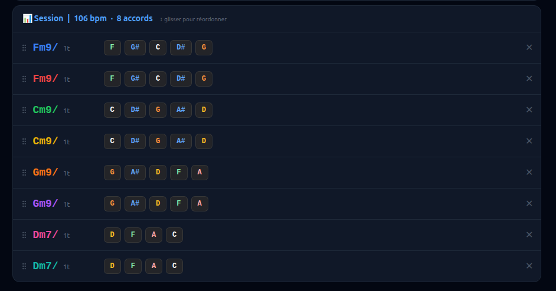
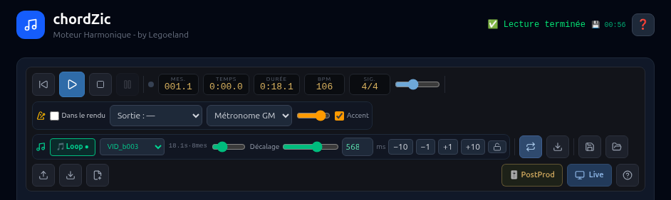
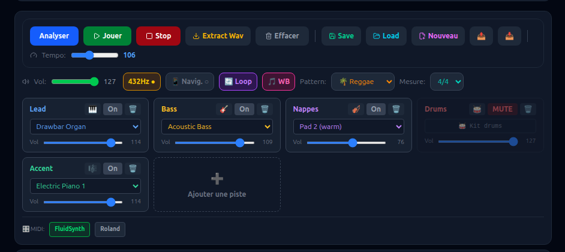
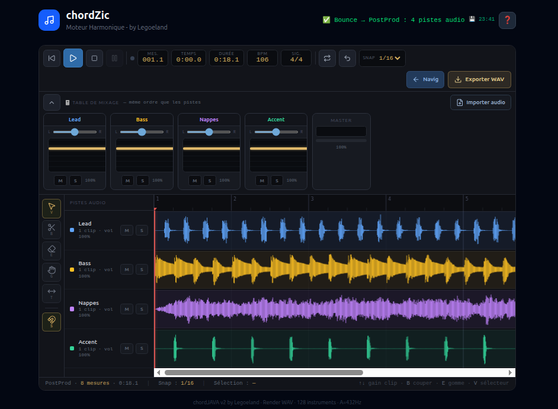

# chord-frontend — Frontend de chordZIC V2

Interface web **React + TypeScript + Vite** de **chordZIC V2** : un séquenceur de
grilles d'accords avec piano rolls, pistes drums, boucles d'échantillons, table de
mixage et export audio.

- Backend : [chordzic-server](https://github.com/legoeland06/chordzic-server)
- Dev server : **http://localhost:5176**

---

## Fonctionnalités

### Grille & lecture
- Saisie d'accords avec durée (4, 2, 1, 8, 16 temps) et **silences réels** (`4:_`, `2:_`, `1:_`)
- Tempo, signature, loop on/off, A = 432 Hz, master volume
- 6 patterns batterie, walking bass, pompe skank, accent 2&4
- Mode serveur (MIDI → FluidSynth) et mode Navigateur (Web Audio)


*Grille d'accords en saisie texte (mode Live)*


*Panneau de sélection des accords (mode Live)*


*Panneau de contrôle (mode Navigateur)*

### Pistes & piano rolls
- Pistes 🎹 instrument et 🥁 **drums** (jouées sur le canal 9)
- Piano roll par piste : notes, sélection, groupes ⛓, déplacement, zoom
- **Copier / coller inter-pistes** : presse-papiers global du projet
  (Ctrl+C copie la sélection, sinon toute la piste ; collage miroir aux mêmes
  emplacements sur une autre piste, avec confirmation et fusion annulable Ctrl+Z)
- Suppression de piste avec confirmation obligatoire


*Vue d'une piste (mode Navigateur)*


*Liste des pistes avec contrôle (mode Live)*

### Table de mixage
- Volume, mute, sélecteur d'instrument par piste
- Réordonnancement des pistes, mini-vumètres
- Indicateur 💾 d'autosave


*Panneau de contrôle et table de mixage (mode Navigateur)*

### Samples (boucles)
- Boucle d'échantillon par piste : volume, **offset/décalage** mémorisés par sample
- **Recadrage automatique sur la grille** (v2.6.7) : la période de boucle est forcée
  à un multiple exact de la mesure (tempo + signature) — sample trop long **coupé**,
  trop court **complété par du silence**, micro fade-out anti-clic
- Démarrage calé dès le premier Play (phase recalculée après chargement)
- Extraction WAV : le sample actif est **mixé** au morceau exporté

### Sauvegarde
- **Autosave local** (localStorage, debounce 800 ms + flush au beforeunload)
  — F5 ne perd rien, restauration automatique au chargement
- Save / Load / Import côté serveur (archives)
- Préférences locales (offset sample, click…) persistées par sample

### Post-production
- Vue de post-production pour l'assemblage et l'édition des rendus


*Modal de post-production*

### Aide intégrée
- Bouton ❓ → **HelpModal** : documentation utilisateur complète, mise à jour à chaque release

---

## Développement

```bash
npm install
npm run dev      # serveur de dev → http://localhost:5176
npm run build    # build de production (tsc && vite build) → dist/
npm run test     # tests unitaires (vitest)
npm run preview  # prévisualisation du build
```

## Stack

React 19 · TypeScript 5 · Vite 6 · Tailwind CSS 4 · Vitest 4 · lucide-react

## Structure

```
src/
├── components/   # ChordApp, ChordGrid, PianoRoll, DawView, TrackPanel,
│                 # LoopControl, ClickControl, PostProdView, HelpModal…
├── lib/          # audioEngine, browserSynth, sampleLoop, projectClipboard,
│                 # sampleOffsets, pianoRollEngine, postProdEngine…
└── types/
```

## Intégration

Le build (`dist/`) est embarqué dans le binaire standalone du backend
(`chords-server-rs --features standalone`, via `frontend_dist/`).

---

## Développement

**Eric BRUNEAU** — vibe coding Deepseek (legoeland)
