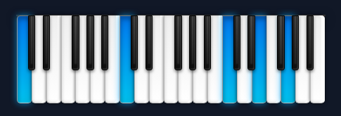
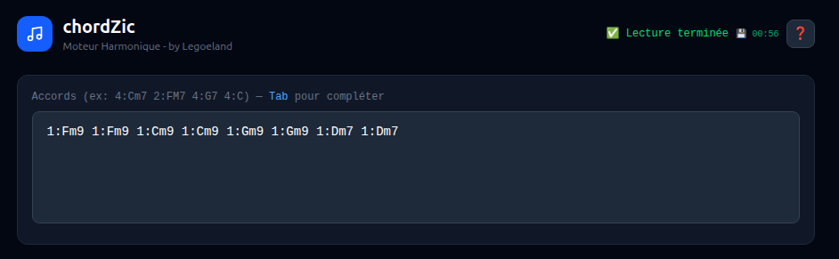
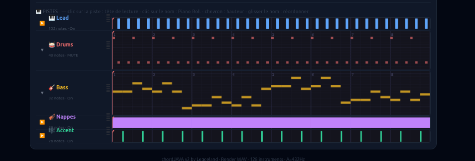
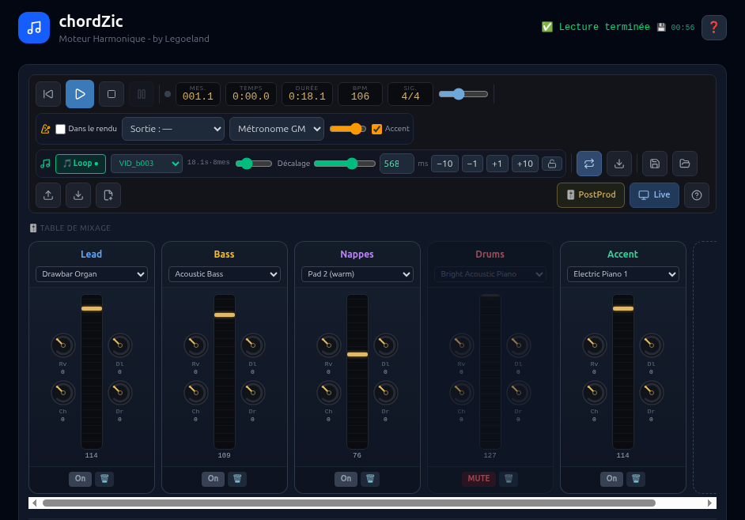

# chord-frontend — Frontend de chordZIC V2

Interface web **React + TypeScript + Vite** de **chordZIC V2** : un séquenceur
de grilles d'accords avec reconnaissance MIDI temps réel, piano 88 touches
illuminé, piano rolls, pistes drums, boucles d'échantillons, table de mixage
et export audio.

- Backend : [chordzic-server](https://github.com/legoeland06/chordzic-server)
- Dev server : **http://localhost:5176**
- Appli complète (frontend embarqué) : **http://localhost:4000**

---

## Les deux modes

### 🎹 LivePiano

Le cœur de l'interface : un **piano 88 touches (A0 → C8)** aligné sur l'étendue
réelle du clavier MIDI (Roland), dont les touches s'illument en bleu **en direct**
quand vous jouez. **Cliquable** : un appui sur une touche (souris ou doigt, multi-touches)
envoie sa note au Roland (note-on / note-off comme un vrai clavier). Commun aux deux
modes : en **Live** il reconnaît l'accord plaqué
(affiché en très gros) et l'insère dans la grille ; en **Navig** il l'insère en
notes dans la piste cible, illumine au contenu de la piste jouée et fait sonner
le Roland avec l'instrument de la piste (program change + sustain). Le piano
s'adapte toujours à la largeur de l'écran.


*LivePiano : accord de Do majeur illuminé (C4·E4·G4), fondamentales C2·C3 à l'octave en basse*

### 🎸 Mode Live (saisie d'accords + piano)
- Saisie d'accords avec durée (4, 2, 1, 8, 16 temps) et **silences réels** (`4:_`, `2:_`, `1:_`)
- **🎹 LivePiano** : piano **88 touches (A0 → C8)** aligné sur le clavier MIDI (Roland) dont les
  touches s'illument en bleu quand vous jouez — reconnaissance d'accords en temps réel
  (accord affiché en très gros + notes en clair), insertion dans la grille (clic, « + Grille »,
  ou **⏱ timer d'auto-insertion** 1-5 s)
- **🎯 Accord en lecture** : modal circulaire translucide montrant l'accord joué par la séquence
- Réglages musicaux (LiveSettingsBar) : volume master, 432 Hz, Loop, Walking Bass, Pattern,
  Mesure, Tempo
- Mode serveur (MIDI → FluidSynth) ; la sortie du synthé se fait via **▶ MIDI**

### 📱 Mode Navig. (vue DAW)
- Panneau supérieur **🎹 Piano / 🎚 Mixer** (rétractable) : le même LivePiano y insère l'accord
  reconnu en **notes** dans la piste cible (celle dont le Piano Roll intégré est ouvert),
  illumine au contenu de la piste jouée (✨, WAV ou MIDI) et transmet au Roland le
  **program change** de la piste (son de la piste, pédale de sustain relayée)
- **Table de mixage** : nom, instrument, MUTE, fader-vumètre, effets (reverb/chorus/delay/drive),
  ajout/suppression/réordonnancement des pistes
- **Pistes horizontales** avec mini-vumètres, locators L/R draggables (boucle [L, R[), tête de
  lecture (scrub au clic)
- Lecture **▶ Play** = rendu audio interne (FluidSynth, silencieux) ; **▶ MIDI** = toutes les
  pistes sur le port choisi (Roland)


*Grille d'accords en saisie texte (mode Live)*


*Vue d'une piste (mode Navigateur)*


*Table de mixage (mode Navigateur)*

## Piano Roll (intégré + modal plein écran)

- **Barre d'outils « studio » unique** (intégré et modal ⛶, parfaitement synchronisés) :
  édition/sélection, copier/couper/coller (presse-papiers global + badge), grouper ⛓,
  vélocité/durée (slider Dur 2× plus long pour la visée), snap 🧲 + quantiser, transport local ▶, undo/redo
- **⌨️ Raccourcis clavier** : E/V = outils Édition/Sélection · Ctrl+G/U = grouper/dégrouper ·
  Q = quantiser · * = REC · 0/1/2 = tête au début / locator L / locator R · O = zoom sur la sélection ·
  Ctrl+Espace = lecture audio · Shift+Espace = lecture MIDI · G/H = zoom horizontal
- **● Rec MIDI** : enregistrement du clavier (Roland) dans la piste agrandie — décompte de
  4 temps au métronome, les notes jouées s'affichent en direct (cyan), insertion à la tête
  de lecture à l'arrêt (événements horodatés côté serveur, ordre d'appui conservé,
  repiquage ignoré). **Play-along** : au démarrage, les AUTRES pistes jouent en
  accompagnement (la piste enregistrée est exclue) ; les MUTE du mixeur choisissent ce
  qu'on entend ; la lecture continue après l'arrêt du REC
- **Fit vertical automatique** : le registre s'adapte au contenu de la piste à l'ouverture
- **Molette** : scroll vertical du registre (1 demi-ton/cran « de case en case », le clavier en marge suit) ·
  Ctrl+molette / G-H = zoom · Shift+molette = horizontal · **⛶ Scan** = zoom sur la sélection
- **Clavier en marge rétractable** (bouton 🎹 sur la marge, préférence mémorisée)
- **Copier / coller inter-pistes** : collage miroir aux mêmes emplacements, fusion annulable Ctrl+Z
- Pistes 🎹 instrument et 🥁 **drums** (canal 9)

## Samples (boucles)

- Boucle d'échantillon : volume, **offset/décalage** mémorisés par sample
- **Recadrage automatique sur la grille** (v2.6.7) : période forcée à un multiple exact de la
  mesure — sample trop long **coupé**, trop court **complété par du silence**, fade-out anti-clic
- Extraction WAV : le sample actif est **mixé** au morceau exporté

## Performances (lecture temps réel)

- **Lignes de lecture en overlay** : les têtes de lecture (pistes + piano roll) sont des
  divs animées par `transform`/rAF via un store partagé hors React — plus aucun redraw de
  canvas ni re-render global à chaque tick de lecture (les canvas ne redessinent que quand
  le contenu change)
- **Ticker découplé** : le DAW ne re-rend plus à ~25 fps ; les afficheurs
  Mesure/Temps/Durée s'abonnent seuls (~10 fps), l'illumination de la piste suit à ~12 fps,
  les vumètres sont throttlés à ~10 fps
- **React.memo** sur les composants lourds (props stabilisées)

## Sauvegarde

- **Autosave local** (localStorage, debounce 800 ms + flush beforeunload) — F5 ne perd rien
- Save / Load / Import côté serveur (JSON) ; **« Nouveau » garde le mode courant**

## Post-production

- Vue PostProd : bounce des pistes MIDI en audio (WAV, avec effets) puis édition multipiste

## Aide intégrée

- Bouton ❓ → **HelpModal** : documentation utilisateur complète (recherchable), **lecture
  vocale des rubriques à voix haute** (bouton 🔊, synthèse Piper locale)

---

## Développement

```bash
npm install
npm run dev      # serveur de dev → http://localhost:5176
npm run build    # build de production (tsc && vite build) → dist/
npm run test     # tests unitaires (vitest)
npm run preview  # prévisualisation du build
```

## Stack

React 19 · TypeScript 5 · Vite 6 · Tailwind CSS 4 · Vitest 4 · lucide-react

## Structure

```
src/
├── components/   # ChordApp, ChordGrid, PianoRoll, DawView, PianoLivePanel,
│                 # LivePiano, LiveSettingsBar, ControlBar, ChordNowModal,
│                 # LoopControl, ClickControl, PostProdView, PlayheadLine,
│                 # TransportReadout, HelpModal…
├── lib/          # audioEngine, browserSynth, livePiano, pitchesToNotes,
│                 # chordRecognition, pianoRollEngine, playGuard, navPosition,
│                 # sampleLoop, projectClipboard, postProdEngine, playhead…
└── types/
```

## Intégration

Le build (`dist/`) est embarqué dans le binaire standalone du backend
(`chords-server-rs --features standalone`, via `frontend_dist/`).

---

## Développement

**Eric BRUNEAU** — vibe coding Deepseek (legoeland)

*231 tests unitaires (Vitest) — tsc strict à 0 erreur*
